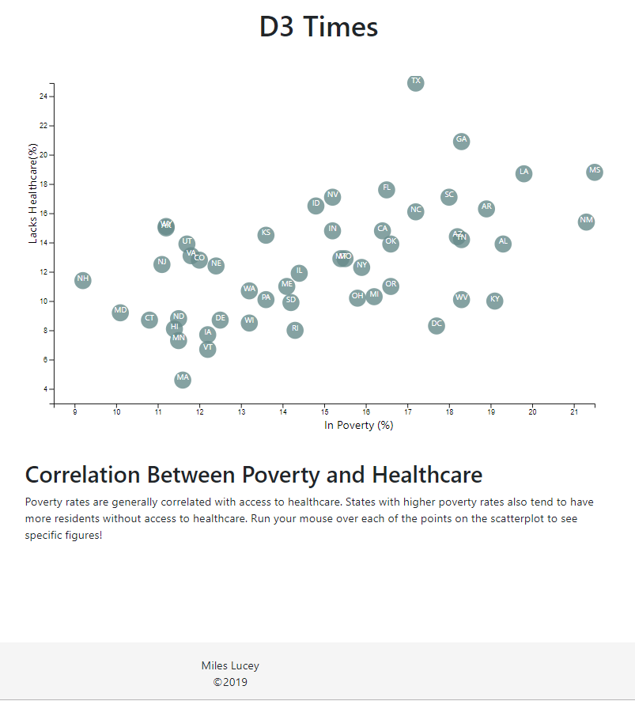

# Data Journalism
## Summary
* A homework assignment for UC Berkeley's Data Analytics Bootcamp
* Creates an interactive chart in D3 exploring the correlation between state poverty rates and healthcare coverage rates
* See published repository here: https://mileslucey.github.io/data_journalism/

